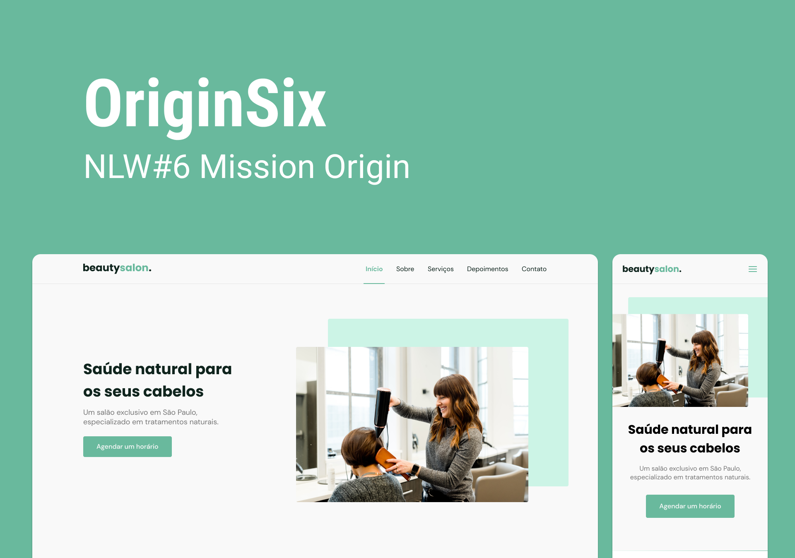

<br />
<p align="center">
  
  <h3 align="center">Beauty Salon - NLW#Together - Origin</h3>
  <p align="center">
    <a href="#">View Demo</a>
    ·
    <a href="https://github.com/Guigalaverna/nlw-together-origin/issues">Report Bug</a>
    ·
    <a href="https://github.com/Guigalaverna/nlw-together-origin/issues">Request Feature</a>
  </p>
</p>

<!-- TABLE OF CONTENTS -->
<details open="open">
  <summary>Table of Contents</summary>
  <ol>
    <li>
      <a href="#about-the-project">About The Project</a>
      <ul>
        <li><a href="#built-with">Built With</a></li>
      </ul>
    </li>
    <li>
      <a href="#getting-started">Getting Started</a>
      <ul>
        <li><a href="#prerequisites">Prerequisites</a></li>
        <li><a href="#installation">Installation</a></li>
      </ul>
    </li>
    <li><a href="#contributing">Contributing</a></li>
    <li><a href="#license">License</a></li>
  </ol>
</details>

<!-- ABOUT THE PROJECT -->
## About The Project

***Beauty salon*** is the project chosen on the Origin track during NLW#Together, which consists of teaching the fundamentals of the web. But I wanted to go the extra mile and use ReactJS to create the interface, using the concepts of componentization, states and others.

There were 5 classes and 5 lives where the trail educator <a href='https://github.com/maykbrito'>Mayk Brito</a> answered students' doubts and taught additional content.

### Built With

The project was built using:
* [ReactJS](https://reactjs.org/)
* [TypeScript](https://typescriptlang.org)
* [Node Sass](https://npmjs.org/package/node-sass)

## Getting Started

### Prerequisites

To see what the project looks like on your machine, you need all these tools:
* [NodeJS](https://nodejs.org)
* [VSCode](https://code.visualstudio.com/)

### Installation
To see what the project looks like on your machine, you need to follow these steps:

1. Clone the repo
   ```sh
   git clone https://github.com/your_username_/Project-Name.git
   ```
2. Install NPM packages
   ```sh
   npm install
   ```
3. Run the project
   ```sh
   npm start
   ```
## Contributing

Contributions are what make the open source community such an amazing place to be learn, inspire, and create. Any contributions you make are **greatly appreciated**.

1. Fork the Project
2. Create your Feature Branch (`git checkout -b feature/AmazingFeature`)
3. Commit your Changes (`git commit -m 'Add some AmazingFeature'`)
4. Push to the Branch (`git push origin feature/AmazingFeature`)
5. Open a Pull Request

<!-- LICENSE -->
## License

Distributed under the MIT License. See `LICENSE` for more information.
